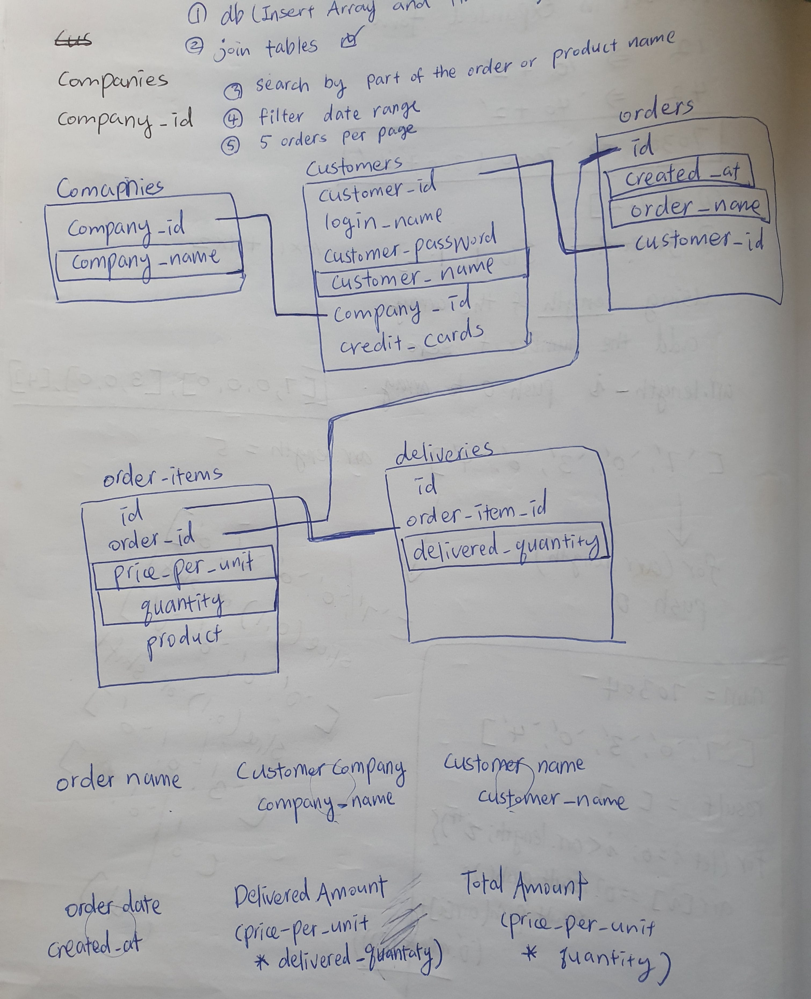

# Order management

## Image

## Break down the problem
- Creating data base with Postgres SQL
- Creating server with NodeJS and Express
- Connect the db and server
- Take the data from db and display it with EJS

### Break down the problem again
Creating data base with Postgres SQL

- Using given data create database and tables(schema.sql)
- Insert give data to the tables(seed.sql)
- Select the specific data for display(psql inner join function)

Creating server with NodeJS and Express
- npm init and install the necessary dependencies and middlewares
- Checking if the server runs successfully(npm start)

Connect the db and server
- Using pool, connect db with server
- Checking if the server requests the data to db successfully(res.json())

Take the data from db and display it with EJS
- Display data using forEach function and EJS syntax

### Working on
pagination feature

